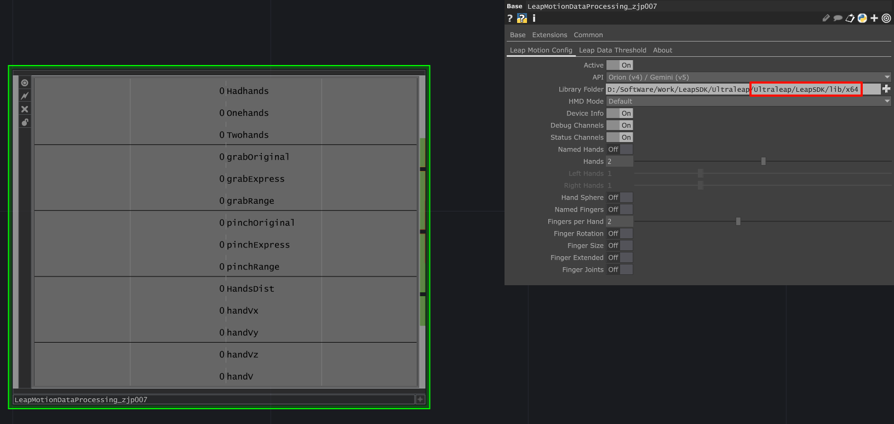
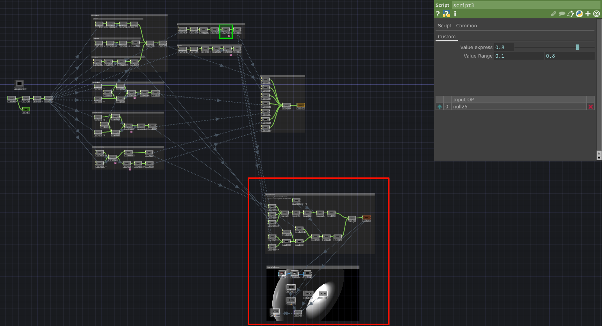
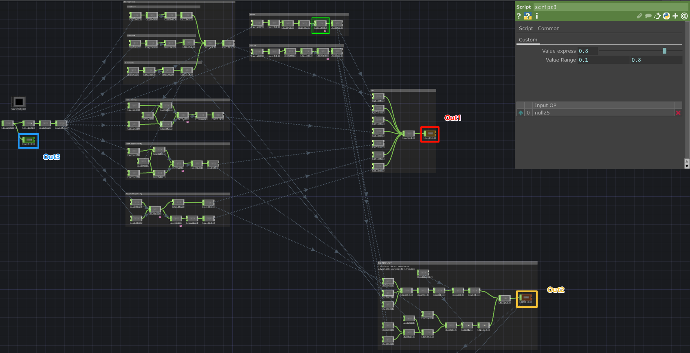
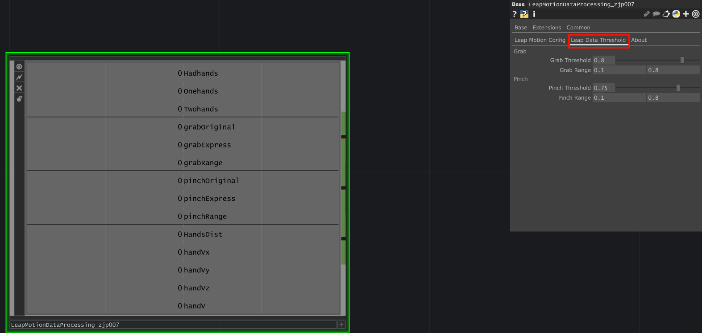

# About

> TouchDesigner >= 2023.11600

## LeapMotionDataProcessing-tox

### LeapMotion plug (EN)

> LeapMotionDataProcessing_zjp007-x.x.tox

1. install LeapMotion SDK and run it 

   [Leap Motion Controller - Ultraleap](https://leap2.ultraleap.com/downloads/leap-motion-controller/)

2. select lib Folder

   

3. Inside the plugin, in the lower left corner is a sample

   

   1. Pinch movement back and forth to control the object (actually the camera) rotation
   2. Clench your hands to zoom in or out to zoom out/in (actually the camera is zooming in/out).

4. Outputs

   

   ​														out1 is the processed data
   ​														out2 is the example data
   ​														out3 is the original LeapMotion data

5. Setting pinch and grip thresholds

   

### LeapMotion 插头 (中文)

> LeapMotionDataProcessing_zjp007-x.x.tox

1. 安装 LeapMotion SDK 并运行 

   [Leap Motion Controller - Ultraleap](https://leap2.ultraleap.com/downloads/leap-motion-controller/)

2. 选择 lib 文件夹

   

3. 在插件内部，左下角有一个示例

   

   1. 前后捏合移动来控制物体（实际上是摄像头）旋转
   2. 双手抓握并移动双手可放大或缩小（实际上是相机放大/缩小）

4. 输出

   

   out1 是处理过的数据
   out2 是示例数据
   out3 是原始 LeapMotion 数据

5. 设置捏合和抓握阈值

   

## EdgeTTS_Portable (EN)

:o: Networking required (relies on Microsoft TTS service)

> :warning: libs must be in the same folder as the TouchDesigner project files (including the EdgeTTS_Portable plugin)

1. Text input text
2. Click `confirm` to generate and play the voice.
3. Select `Voices` to change the voice tone (the bottom will show that the voice tone is male/female).

## EdgeTTS_Portable (中文)

:o: 需要联网 (依赖微软 TTS 服务)

> :warning: libs 必须和 TouchDesigner 工程文件 (包括 EdgeTTS_Portable 插件) 放在相同的文件夹

1. Text 输入文字
2. 点击 `confirm` 即可生成语音并播放
3. 可选 `Voices` 更改不同的音色 (下方会显示选择音色是男声/女生)

